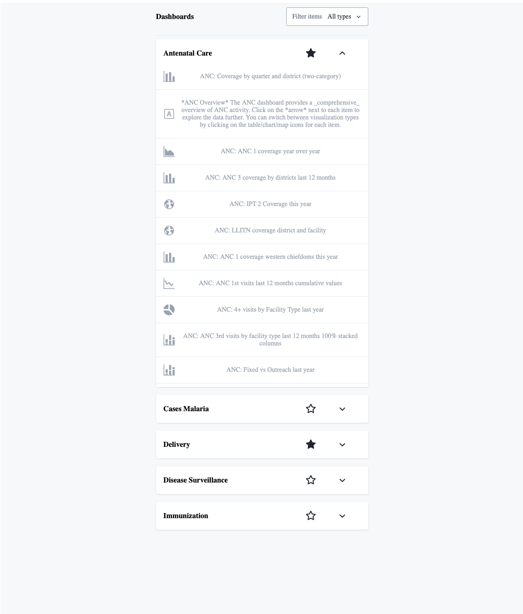

# DHIS2 Challenge (Option 2)



### Tech

- Build tool : [Vite](https://vitejs.dev/guide/)
- Framework: React with typescript template
- Deployement : [Netlifiy](https://docs.netlify.com/get-started/)
- [@vitejs/plugin-react-swc](https://github.com/vitejs/vite-plugin-react-swc) uses [SWC](https://swc.rs/) for Fast Refresh
- UI library : [DHIS2 UI Library](https://ui.dhis2.nu/)

#### [Deployment](https://dhis2-challenge2.netlify.app/)

### Getting started

```shell
# Clone project:
 `git clone https://github.com/athul173/dhis2-challenge.git`
# Install all packages and dependencies:
   `cd dhis2-challenge`
# Install dependencies:
   `yarn`
# Start local server with hot reloading
   `yarn start` 
```

### Deployment 
The build command `yarn run build` will generate a set of static assets in a `dist` folder which can be deployed to any web hosting service.

[Netlify](http://www.netlify.com) will run this build process in a CI environment and then deploy the build automatically to a global CDN. Such deployments are [triggered automatically](https://www.netlify.com/docs/continuous-deployment/) by every git push to the `master` branch of the origin repository.
